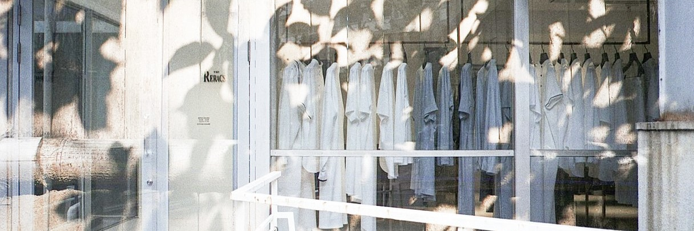

  

# Hi, I'm Hossein 👋

I'm a maker, photographer, and engineering enthusiast who enjoys building things that combine hardware, software, and design. 
I build things… and I appreciate good design.

## 🔧 Things I Work With

- Electronics & Embedded Systems
- Arduino & ESP Projects
- PCB Design
- 3D Modeling (Fusion 360 & Blender)
- 3D Printing
- DIY Hardware Projects
- Swift & iOS Development

## 📂 Current Interests

- Custom mechanical and electronic projects
- Audio equipment and speaker design
- Analog photography
- Product design and prototyping
- Open-source hardware

## 📸 Photography

I enjoy shooting film photography and working with vintage camera equipment.

## 🛠 Favorite Tools

- Fusion 360
- Xcode
- Blender
- KiCad
- Arduino IDE
- VS Code
- Github
  

  

## 🌱 Currently Learning

- Advanced CAD workflows
- Embedded systems design
- iOS app development
- Better PCB design practices

## 📫 Contact Me

  
  
  

---

*"Stay hungry. Stay foolish."* — Steve Jobs
